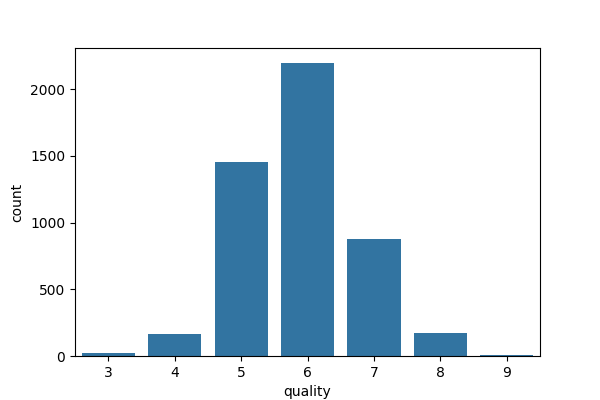
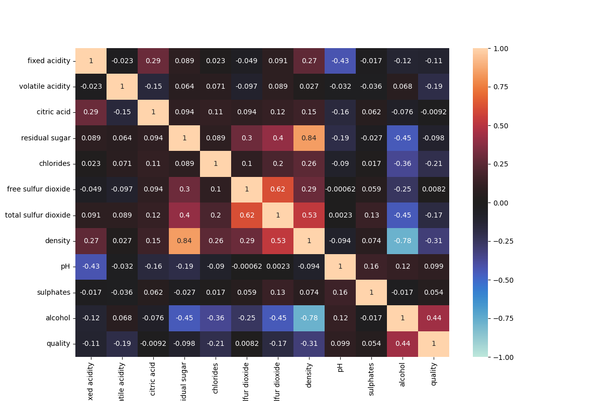

Documentation of Vinho Verde White Wine Quality with Random Forest Classifier of 7 lables
-

Imported packages:
-
- numpy >> for mathematical functions, similar to math package
- pandas >> for data processing
- os >> for file path handling
- seaborn >> for plotting the data
- matplotlib >> for plotting the data
- imblearn >> for oversampling of the dataset
- sklearn >> for the machine learning algorithm

To compare oversampling to no oversampling.
-
```python
oversample = True if input('Press "y" for oversampling and "x" for no oversampling.') == 'y' else False
```

_This line asks the user for an input of "y" meaning yes or "x" meaning no whether to use oversampling or not.
The goal is to compare the effect of oversampling of the underrepresented target variable values._

Checking for missing values.
-
```python
    print(out := 'There are missing values!' if (df_initial.isna().sum() != 0).any() else 'There are no missing values.')
    print()
    if out == 'There are missing values!':
        print(df_initial.isna().sum())
        print()
```
_One should check for missing values in the dataset. There a many different methods to substitute
missing values in the dataset which will be covered in another dataset. In the present dataset if 
a missing value is encountered, it was deleted. Fortuantely the dataset is whole._

Checking and removing the duplicate data.
-
```python
print(out := f'There are {df_initial.duplicated().sum()} duplicates!' if df_initial.duplicated().sum() != 0 else
      'There are no duplicates.')
print()
if out != 'There are no duplicates.':
    df_initial.drop_duplicates(keep='first')
```

_One should check for duplicate entry in the dataset because duplicate data can cause a bias causing
the model to learn these patterns disproportionately. It can cause overfitting or false feature importance._

Checking for quality distribution
-
```python
plt.figure(figsize=(6, 4), dpi=100)
sns.countplot(data=df_initial, x='quality')
df_initial['quality'].value_counts()
plt.show()
```
_It is important to check for the target variable distribution because if the target variable is imbalanced, the model may favor the majority class or region of the distribution.
This can result in poor performance for minority classes or regions, which may be critical for the problem you're solving._


**Figure 1: Quality distribution of the initial data.**

_Figure 1. shows that there is a significant imbalance in the distribution of the target variable. It means that
the poor quality and excellent quality is underrepresented. There are different methods to solve the imbalance
one is oversampling. The difference between the initial and oversampled dataset will be shown in this document._

Checking for correlation matrix
-
```python
plt.figure(figsize=(12, 8), dpi=100)
sns.heatmap(df_initial.corr(), vmin=-1, vmax=1, cmap='icefire', annot=True)
plt.savefig('01_RFC_7labels_figure_02', dpi=100)
```

_Features with low correlation to the target variable may have little predictive power.
Features with high correlation to the target can be prioritized, helping reduce dimensionality and improve model efficiency._


**Figure 2: Correlation matrix of the initial data.**

__

Selecting highly correlated features to the target variable
-
```python
relevant_features = df_initial.corr()['quality'][abs(df_initial.corr()['quality']) > 0.1]
print(relevant_features)
print()
```

