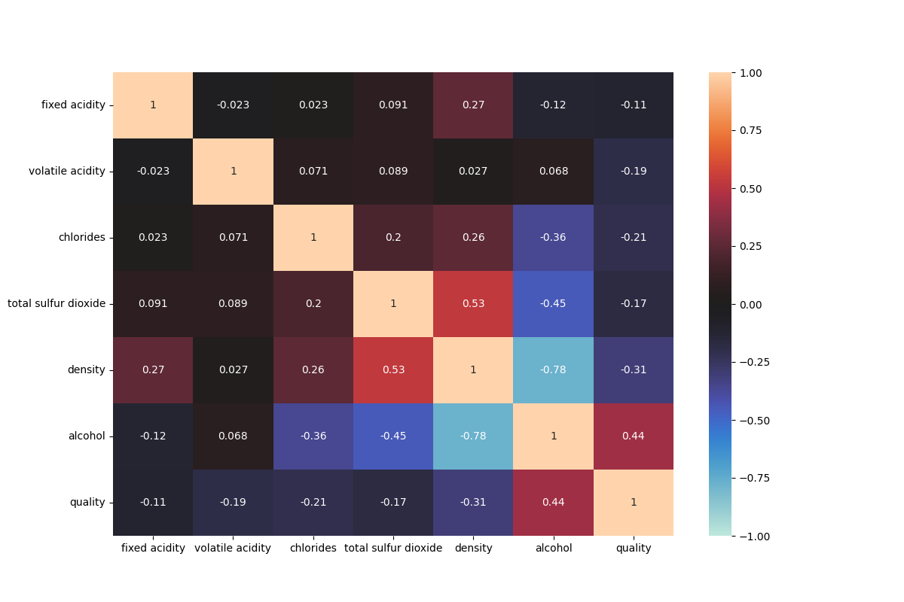
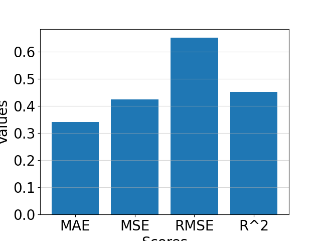
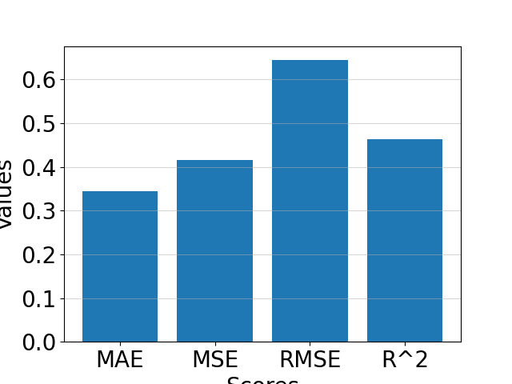

Documentation of Vinho Verde White Wine Quality with Random Forest Classifier of 7 lables
-

Imported packages:
-
- numpy >> for mathematical functions, similar to math package
- pandas >> for data processing
- os >> for file path handling
- seaborn >> for plotting the data
- matplotlib >> for plotting the data
- imblearn >> for oversampling of the dataset
- sklearn >> for the machine learning algorithm

To compare oversampling to no oversampling.
-
```python
oversample = True if input('Press "y" for oversampling and "x" for no oversampling.') == 'y' else False
```

_This line asks the user for an input of "y" meaning yes or "x" meaning no whether to use oversampling or not.
The goal is to compare the effect of oversampling of the underrepresented target variable values._

Checking for missing values.
-
```python
    print(out := 'There are missing values!' if (df_initial.isna().sum() != 0).any() else 'There are no missing values.')
    print()
    if out == 'There are missing values!':
        print(df_initial.isna().sum())
        print()
```
_One should check for missing values in the dataset. There a many different methods to substitute
missing values in the dataset which will be covered in another dataset. In the present dataset if 
a missing value is encountered, it was deleted. Fortuantely the dataset is whole._

Checking and removing the duplicate data.
-
```python
print(out := f'There are {df_initial.duplicated().sum()} duplicates!' if df_initial.duplicated().sum() != 0 else
      'There are no duplicates.')
print()
if out != 'There are no duplicates.':
    df_initial.drop_duplicates(keep='first')
```

_One should check for duplicate entry in the dataset because duplicate data can cause a bias causing
the model to learn these patterns disproportionately. It can cause overfitting or false feature importance._

Checking for quality distribution.
-
```python
plt.figure(figsize=(6, 4), dpi=100)
sns.countplot(data=df_initial, x='quality')
df_initial['quality'].value_counts()
plt.show()
```
_It is important to check for the target variable distribution because if the target variable is imbalanced, the model may favor the majority class or region of the distribution.
This can result in poor performance for minority classes or regions, which may be critical for the problem you're solving._


**Figure 1: Quality distribution of the initial data.**

_Figure 1. shows that there is a significant imbalance in the distribution of the target variable. It means that
the poor quality and excellent quality is underrepresented. There are different methods to solve the imbalance
one is oversampling. The difference between the initial and oversampled dataset will be shown in this document._

Checking for correlation matrix.
-
```python
plt.figure(figsize=(12, 8), dpi=100)
sns.heatmap(df_initial.corr(), vmin=-1, vmax=1, cmap='icefire', annot=True)
plt.savefig('01_RFC_7labels_figure_02', dpi=100)
```

_Features with low correlation to the target variable may have little predictive power.
Features with high correlation to the target can be prioritized, helping reduce dimensionality and improve model efficiency._


**Figure 2: Correlation matrix of the initial data.**

_The correlation matrix shows that some features does not contribute linearly to the target variable.
If the correlation is less than |-0.1| then it offeres low predictive power to the algorithm. On the other hand
it can be determined that higher alcohol content greatly improves the image of the wine. The featiures with low
correlation should be excluded from the future investigation._

Selecting highly correlated features to the target variable.
-
```python
relevant_features = df_initial.corr()['quality'][abs(df_initial.corr()['quality']) > 0.1]
print(relevant_features)
print()

columns_to_keep = relevant_features.index.tolist()
df_relevant = df_initial[columns_to_keep]
```
_This line selects the relevant features explained beforehand._

Check for multicollinearity between the features.
-

```python
plt.figure(figsize=(12, 8), dpi=100)
sns.heatmap(df_relevant.corr(), vmin=-1, vmax=1, cmap='icefire', annot=True)
plt.savefig('01_RFC_7labels_figure_03', dpi=100)
plt.show()

del df_relevant['density']

df_temp = df_initial.copy(deep=True)
```
_Checking for multicollinearity is essential because it helps identify redundant information in features, which can
increase model complexity and lead to overfitting without adding predictive value. Additionally, it complicates the 
interpretability of features, making it difficult to determine which variables are truly contributing to the model's 
output. Multicollinearity can also mask the importance of other relevant features, causing the model to prioritize 
redundant variables over weaker but valuable signals. Many machine learning algorithms and statistical models assume
minimal correlation between features, and multicollinearity can violate these assumptions, leading to inaccurate or 
suboptimal results._



**Figure 3: Multicolinearity matrix of the initial data.**

_The matrix shows that alcohol content is highly correlated to the density of the wine. Meaning one should
delete density as higher alcohol content has higher correlation to the target variable. To check their effect there will
be two different path shown. One without density and one without alcohol features._

A direction without the density feature vs. without alcohol feature and without oversampling.
-

<div style="display: flex; justify-content: space-around;">

<div>

<p style="text-align: center;">Figure 4: Evaluation metrics without density feature.</p>
</div>

<div>

<p style="text-align: center;">Figure 5: Evaluation metrics without alcohol feature.</p>
</div>

</div>

_Mean Absolute Error (MAE): MAE measures the average absolute difference between predicted and actual values, treating 
all errors equally regardless of their direction. It provides a clear understanding of how far predictions are, on 
average, from actual values, making it easy to interpret. (Lower the better!)_

_Mean Squared Error (MSE): MSE calculates the average of squared differences between predicted and actual values, 
emphasizing larger errors by squaring them. This makes MSE highly sensitive to outliers, which can be beneficial when 
larger errors need to be penalized more heavily in certain applications. (Lower the better!)_

_Root Mean Squared Error (RMSE): RMSE is the square root of MSE and provides a single measure of prediction error, 
expressed in the same units as the target variable. It offers a more interpretable metric for evaluating model 
performance and highlights significant errors due to its sensitivity to larger deviations. (Lower the better!) RMSE is 
the root of MSE. It should be lower than MSE except 0 < MSE < 1._

_R-squared (R²): R² represents the proportion of variance in the target variable that is explained by the model,
ranging from 0 to 1, where higher values indicate better fit. It provides insight into how well the model captures the 
relationships in the data, helping assess overall effectiveness and goodness-of-fit. (Higher the better!)_

_From the figures it can be seen that there are no significant difference between the two
solutions. It means that deleting the highly multicolinear alcohol or denstity feature does not 
affects the precision of the model._

Hold both the density and alcohol feature without oversampling.
-

