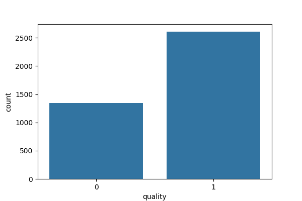
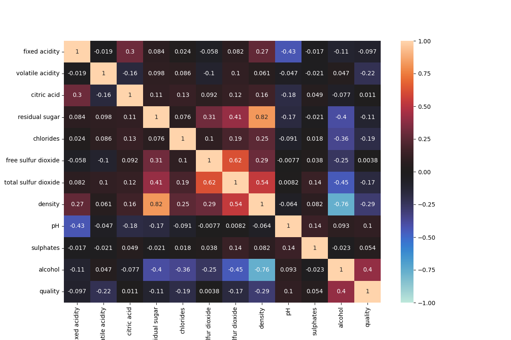
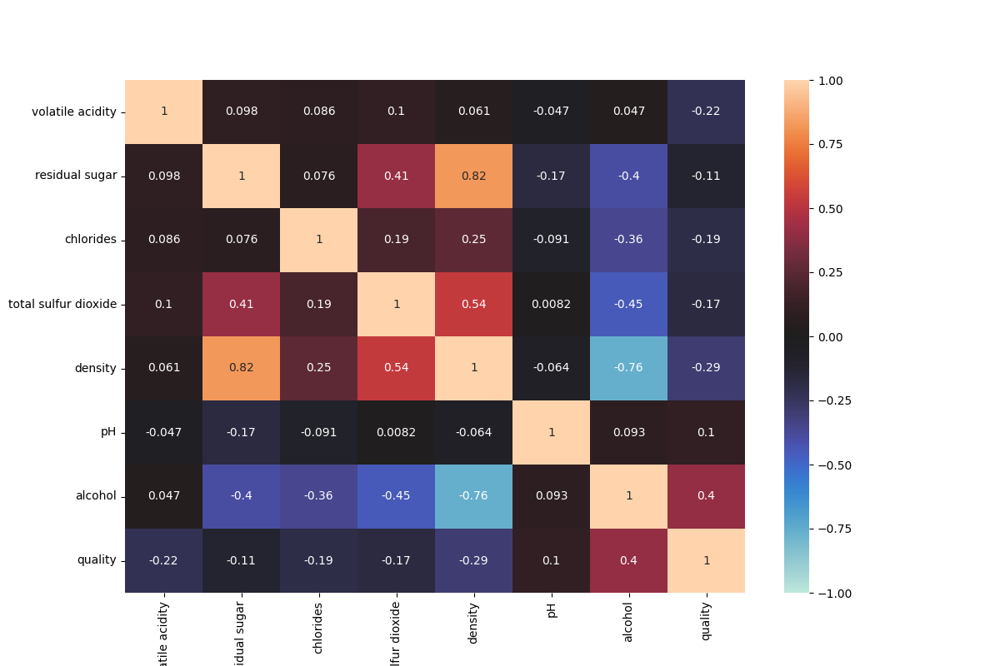
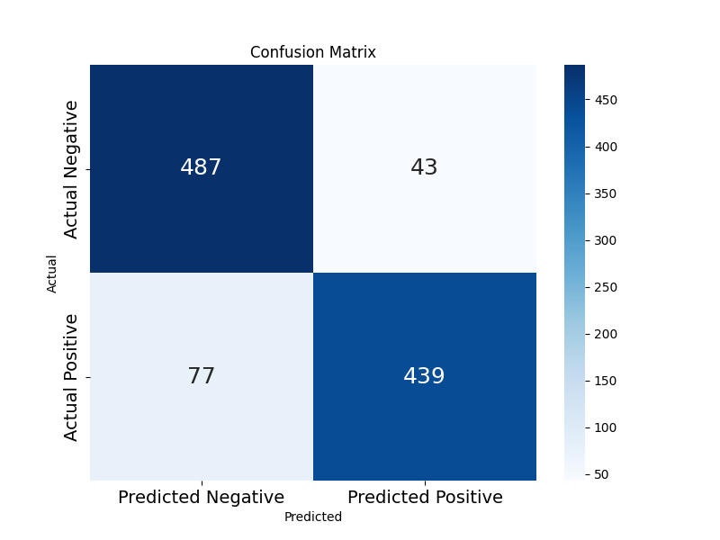
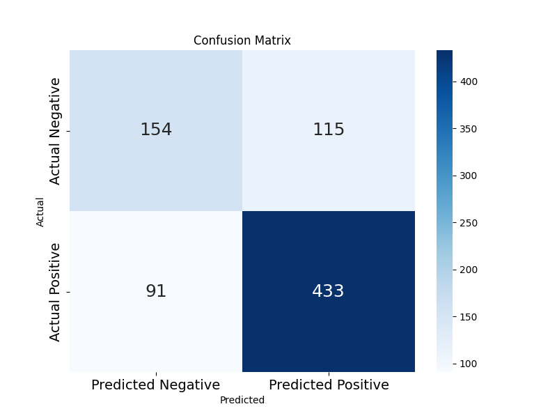
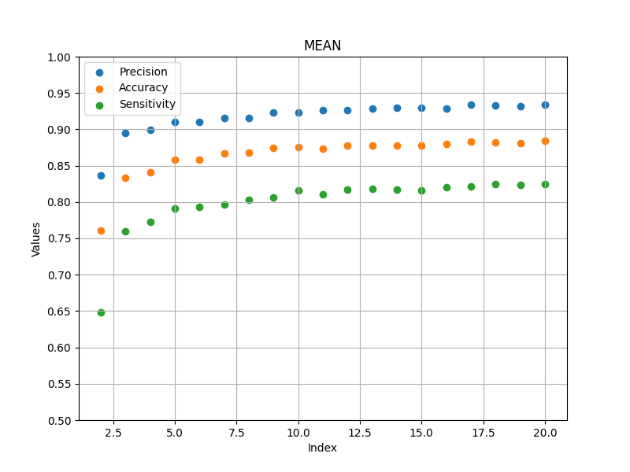
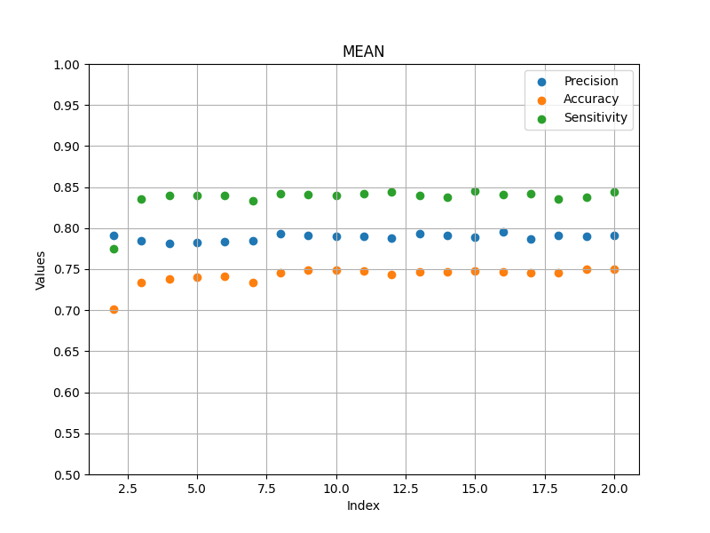

Documentation of Vinho Verde White Wine Quality with Random Forest Classifier of 7 lables
-

Imported packages:
-
- numpy >> for mathematical functions, similar to math package
- pandas >> for data processing
- os >> for file path handling
- seaborn >> for plotting the data
- matplotlib >> for plotting the data
- imblearn >> for oversampling of the dataset
- sklearn >> for the machine learning algorithm

To compare oversampling to no oversampling.
-
```python
oversample = True if input('Press "y" for oversampling and "x" for no oversampling.') == 'y' else False
```

_This line asks the user for an input of "y" meaning yes or "x" meaning no whether to use oversampling or not.
The goal is to compare the effect of oversampling of the underrepresented target variable values._

```python
# Open the .csv file; the with function ensure that the .csv is closed after use----------------------------------------
with open(folder_path + '/initial_data/white_wine_quality.csv', 'r') as f:
    df_initial = pd.read_csv(f, sep=';')

# Create a deepcopy of the initial dataframe to modify it with 'good' if quality > 5 else 'bad'
df_two_label = df_initial.copy(deep=True)

df_two_label['quality'] = [1 if df_initial['quality'][i] > 5 else 0 for i in range(len(df_initial))]
```

_The difference from 01_RFC_7labels is that here the labels are compacted into two 'good' or 'bad' labels._

# Exploratory Data Analysis:

Checking for missing values.
-
```python
# Checking for missing values-------------------------------------------------------------------------------------------
print(out := 'There are missing values!' if (df_two_label.isna().sum() != 0).any() else 'There are no missing values.')
print()
if out == 'There are missing values!':
    print(df_two_label.isna().sum())
    print()
```
_One should check for missing values in the dataset. There a many different methods to substitute
missing values in the dataset which will be covered in another dataset. In the present dataset if 
a missing value is encountered, it was deleted. Fortuantely the dataset is whole._

Checking and removing the duplicate data.
-
```python
# Checking and removing the duplicate data------------------------------------------------------------------------------
print(out := f'There are {df_two_label.duplicated().sum()} duplicates!' if df_two_label.duplicated().sum() != 0 else
      'There are no duplicates.')
print()
df_two_label = df_two_label.drop_duplicates(keep='first')
df_two_label.reset_index(drop=True, inplace=True)
```

_One should check for duplicate entry in the dataset because duplicate data can cause a bias causing
the model to learn these patterns disproportionately. It can cause overfitting or false feature importance._

Checking for quality distribution.
-
```python
plt.figure(figsize=(6, 4), dpi=100)
sns.countplot(data=df_initial, x='quality')
df_initial['quality'].value_counts()
plt.show()
```
_It is important to check for the target variable distribution because if the target variable is imbalanced, the model may favor the majority class or region of the distribution.
This can result in poor performance for minority classes or regions, which may be critical for the problem you're solving._



**Figure 1: Quality distribution of the initial data.**

_Figure 1. shows that there is a significant imbalance in the distribution of the target variable. It means that
the poor quality and excellent quality is underrepresented. There are different methods to solve the imbalance
one is oversampling. The difference between the initial and oversampled dataset will be shown in this document._

Checking for correlation matrix.
-
```python
# Checking for correlation matrix---------------------------------------------------------------------------------------
plt.figure(figsize=(12, 8), dpi=100)
sns.heatmap(df_two_label.corr(), vmin=-1, vmax=1, cmap='icefire', annot=True)
plt.savefig('02_RFC_7labels_figure_02', dpi=100)
plt.show()
```

_Features with low correlation to the target variable may have little predictive power.
Features with high correlation to the target can be prioritized, helping reduce dimensionality and improve model efficiency._



**Figure 2: Correlation matrix of the initial data.**

_The correlation matrix shows that some features does not contribute linearly to the target variable.
If the correlation is less than |-0.1| then it offeres low predictive power to the algorithm. On the other hand
it can be determined that higher alcohol content greatly improves the image of the wine. The featiures with low
correlation should be excluded from the future investigation._

Selecting highly correlated features to the target variable.
-
```python
# Selecting highly correlated features to the target variable-----------------------------------------------------------
relevant_features = df_two_label.corr()['quality'][abs(df_two_label.corr()['quality']) > 0.1]
print(relevant_features)
print()
```
_This line selects the relevant features explained beforehand._

Check for multicollinearity between the features.
-

```python
plt.figure(figsize=(12, 8), dpi=100)
sns.heatmap(df_relevant.corr(), vmin=-1, vmax=1, cmap='icefire', annot=True)
plt.savefig('02_RFC_7labels_figure_03', dpi=100)
plt.show()
```
_Checking for multicollinearity is essential because it helps identify redundant information in features, which can
increase model complexity and lead to overfitting without adding predictive value. Additionally, it complicates the 
interpretability of features, making it difficult to determine which variables are truly contributing to the model's 
output. Multicollinearity can also mask the importance of other relevant features, causing the model to prioritize 
redundant variables over weaker but valuable signals. Many machine learning algorithms and statistical models assume
minimal correlation between features, and multicollinearity can violate these assumptions, leading to inaccurate or 
suboptimal results._



**Figure 3: Multicolinearity matrix of the initial data.**

_The matrix shows that alcohol content is highly correlated to the density of the wine. Meaning one should
delete density as higher alcohol content has higher correlation to the target variable. To check their effect there will
be two different path shown. One without density and one without alcohol features._

Without oversampling or with it.
-

<div style="display: flex; justify-content: space-around;">

<div>

<p style="text-align: center;">Figure 4: Confusion matrix with oversampling.</p>
</div>

<div>

<p style="text-align: center;">Figure 5: Confusion matrix without oversampling.</p>
</div>

</div>

_For a binary classification problem, the confusion matrix is the following layout:_

|                | **Predicted Positive** | **Predicted Negative** |
|----------------|-------------------------|-------------------------|
| **Actual Positive** | True Positive (TP)       | False Negative (FN)      |
| **Actual Negative** | False Positive (FP)      | True Negative (TN)       |

_True Positive (TP): Correctly predicted positives (e.g., the model predicts "yes," and the actual value is "yes")._

_False Negative (FN): Incorrectly predicted negatives (e.g., the model predicts "no," but the actual value is "yes")._

_False Positive (FP): Incorrectly predicted positives (e.g., the model predicts "yes," but the actual value is "no")._

_True Negative (TN): Correctly predicted negatives (e.g., the model predicts "no," and the actual value is "no")._

### Key Metrics Derived from the Confusion Matrix

1. **Accuracy**: Proportion of correct predictions (true positives and true negatives) out of all predictions.

Accuracy = (TP + TN) / (TP + TN + FP + FN)

2. **Precision (Positive Predictive Value)**: Fraction of positive predictions that are actually correct.

Precision = TP / (TP + FP)

3. **Recall (Sensitivity or True Positive Rate)**: Fraction of actual positives that the model correctly identifies.

Recall = TP / (TP + FN)

4. **F1-Score**: Harmonic mean of precision and recall, balancing their trade-off.

F1-Score = 2 * (Precision * Recall) / (Precision + Recall)

5. **Specificity (True Negative Rate)**: Fraction of actual negatives that the model correctly identifies.

Specificity = TN / (TN + FP)

### Confusion Matrix Metrics Summary

| **Metric**     | **Oversampled**   | **Without oversampling** | **Difference** |
|----------------|-------------------|--------------------------|----------------|
| Accuracy       | 0.881 (88.1%)     | 0.741 (74.1%)            | +0.140 (14.0%) |
| Precision      | 0.910 (91.0%)     | 0.787 (78.7%)            | +0.123 (12.3%) |
| Recall         | 0.843 (84.3%)     | 0.834 (83.4%)            | +0.009 (0.9%)  |
| F1-Score       | 0.874 (87.4%)     | 0.808 (80.8%)            | +0.066 (6.6%)  |
| Specificity    | 0.919 (91.9%)     | 0.561 (56.1%)            | +0.358 (35.8%) |

_The table of confusion matrix metrics summary show that oversampling of the negative labeled cases
significantly improves the specificity of the model, meaning increasing the actual negatives that the model correctly 
identifies. The more samples the model has, it predicts the objectives better. A high F1 score (close to 1) indicates 
a model with both high precision and high recall. A low F1 score suggests that the model struggles with either 
precision, recall, or both. To correctly interpret F1 score first we need to interpret precision and recall. High 
precision indicates that when the model predicts a positive, it is likely correct. High precision is important
when he cost of a false positive is high, for example fraud detection of banking systems. Oversampling the
negative labeled cases decreases the false positive predictions thus increasing the precision.
Precision often comes at the expense of recall. If the model predicts fewer positives (to avoid false positives), it
may miss some actual positives, lowering recall. High recall means few false negatives which is scrucial in disease 
screening, high recall ensures most sick patients are identified, even if it means some healthy individuals are flagged.
Now back to F1 score, high F1 means that there are low amount of false negatives and low amount of false positives.
Last but not least accuracy indicates the model is making correct predictions most of the time. If a model achieves 95%
accuracy, it correctly predicts the outcome for 95 out of 100 instances. Accuracy can be misleading in imbalanced 
datasets when one class significantly outweighs the other. Accuracy is useful when the dataset is balanced positive 
and negative instances are equally represented. When both classes are equally important (false positives and false
negatives have similar consequences). Oversampling balances the dataset thus increasing accuracy._

K-fold cross validation
-


<div style="display: flex; justify-content: space-around;">

<div>

<p style="text-align: center;">Figure 6: Evaluation metrics without both density and alcohol features.</p>
</div>

<div>

<p style="text-align: center;">Figure 7: Evaluation metrics without both alcohol and density features.</p>
</div>

</div>

_It can be seen that there are no significant differences in the metric result in any case. Meaning a deleting both
features could decrease the model complexity without alcohol and dennsity features._